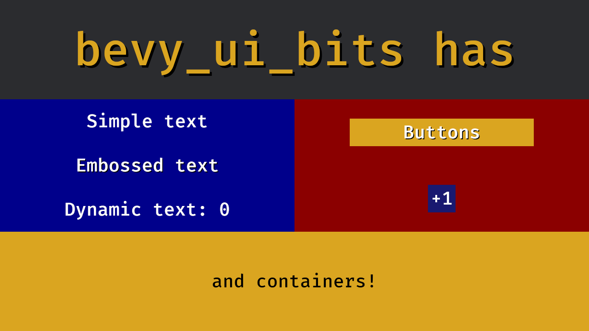
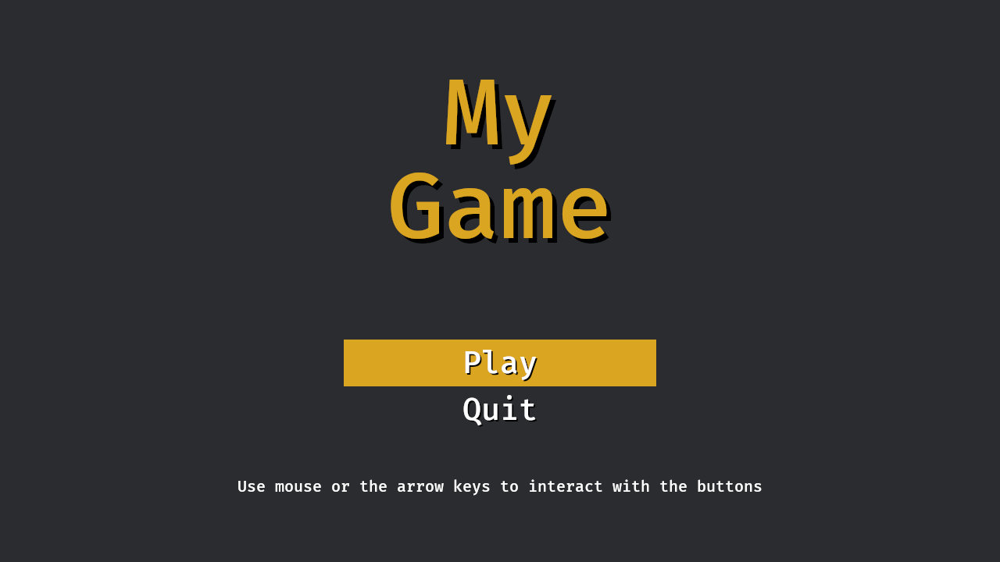
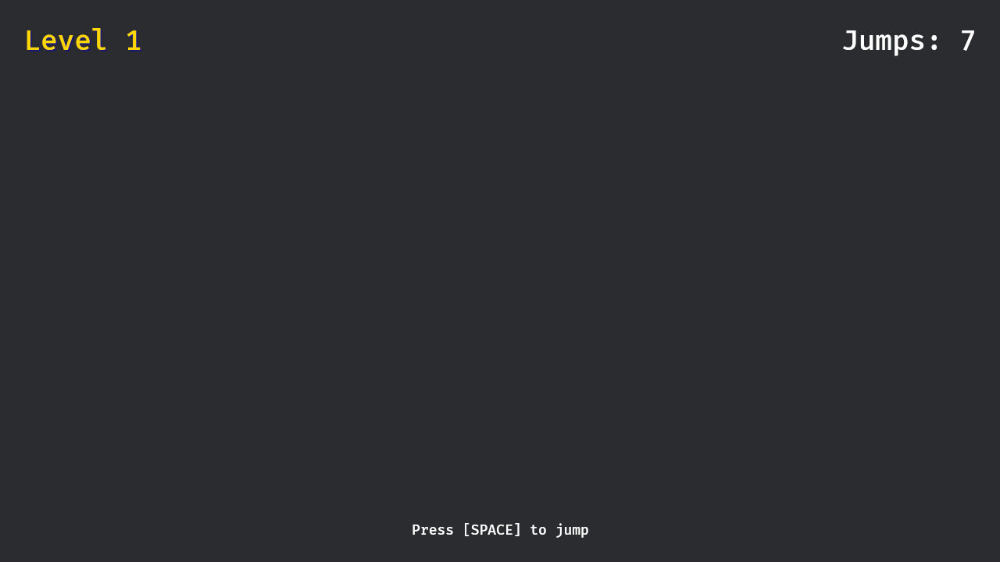
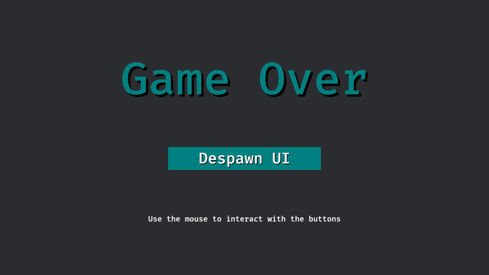

# BEVY UI BITS

[](https://crates.io/crates/bevy_ui_bits)
[](https://crates.io/crates/bevy_ui_bits)

A mingy and opinionated collection of UI components for Bevy

## Usage

```rust
use bevy::{color::palettes, prelude::*};
use bevy_ui_bits::*;

fn main() {
    App::new()
        .add_plugins(DefaultPlugins)
        .add_systems(Startup, spawn_ui)
        .run();
}

fn spawn_ui(mut commands: Commands) {
    commands.spawn(Camera2d::default());

    let font = &Handle::default();

    // Root is the base layout component for a given UI tree
    let root = Root::new();

    // Container is the typical layout component
    let main_container = Container::height(Val::Px(500.0)).justify_between();

    // Customize components fluently using a builder-lite pattern
    let title = EmbossedText::large("My Game", font).color(palettes::css::GOLDENROD.into());

    // UiButton provides a button with opinionated settings
    let play = UiButton::rectangle().background_color(palettes::css::GOLDENROD.into());
    let play_text = EmbossedText::medium("Play", font);

    let by = SimpleText::small("By me", font);

    // Use the new Spawn API to spawn the UI tree
    commands.spawn((
        root,
        children![(
            main_container,
            children![title, (play, children![play_text]), by]
        )],
    ));
}

```

Try it out with:

```
cargo run --example readme --features="bevy/default"
```

## Examples

### Features showcase



Try it out with:

```
cargo run --example showcase --features="bevy/default"
```

### Basic main menu UI that supports both mouse and keyboard input



Try it out with:

```
cargo run --example main_menu --features="bevy/default"
```

### Simple HUD that features a dynamic text component



Try it out with:

```
cargo run --example hud --features="bevy/default"
```

### Despawn UI recursively with the `RootMarker`



Try it out with:

```
cargo run --example despawn --features="bevy/default"
```

## Bevy Compatibility

| bevy | bevy_ui_bits |
| ---- | ------------ |
| 0.16 | 0.8 .. 0.11  |
| 0.15 | 0.7          |
| 0.14 | 0.6          |
| 0.13 | 0.5          |
| 0.12 | 0.4          |
| 0.11 | 0.3          |
| 0.10 | 0.2          |
| 0.9  | 0.1          |

## License

This project is dual-licensed under either:

- MIT license ([LICENSE-MIT](LICENSE-MIT) or https://opensource.org/licenses/MIT)
- Apache License, Version 2.0, ([LICENSE-APACHE](LICENSE-APACHE) or https://www.apache.org/licenses/LICENSE-2.0)

at your option.

With the exception of the Fira Mono Font, which has its own license.

## Contribution

Unless you explicitly state otherwise, any contribution intentionally submitted
for inclusion in the work by you, as defined in the Apache-2.0 license, shall be
dual licensed as above, without any additional terms or conditions.
